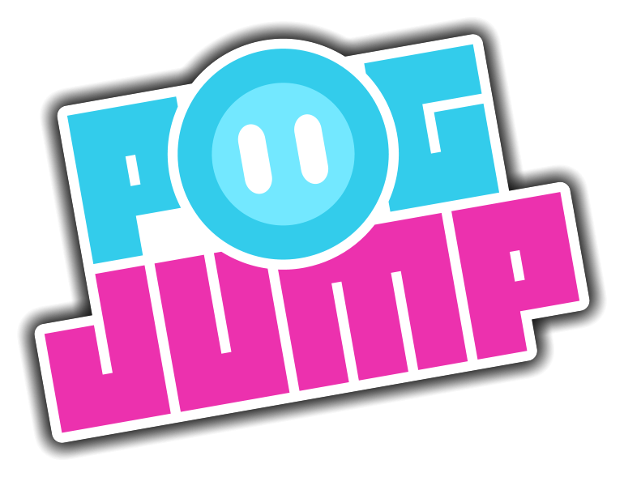
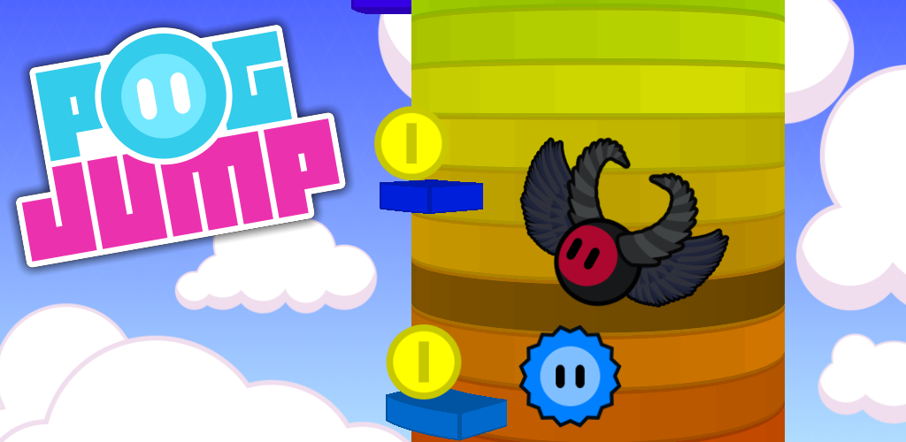

# Pog Jump

  

  

---

Pog Jump ist ein einfaches, aber unterhaltsames Spiel, bei dem man einen Turm hochklettern muss. Der Spieler springt dabei von Treppe zu Treppe und muss geschickt Hindernissen ausweichen, um so weit wie möglich zu kommen.

- **1000 Kostüme** für den Spieler mit 6 verschiedene Designmöglichkeiten, darunter Farbe, Kopfschmuck, Gesichtsschmuck, Accessoires 1 & 2 und Character-Muster
- **3 Spielmodi** für abwechslungsreiches Gameplay  
- **Shop** mit In-Game-Münzen (kein echtes Geld)  
- **Meter Pass** (ähnlich wie ein Season Pass)  
- **Responsive Design** – passt sich jedem Bildschirm optimal an  
- **Options**: 30 FPS / 60 FPS / Vsync
- **Drei Sprachen**: Englisch, Deutsch, Französisch  
- **5 wählbare Level-Designs**, zwischen denen der Spieler wechseln kann
- **Grafikstil**: 3D-Turm mit 2D-Charakteren und Gegnern

---

Der Quellcode von **Pog Jump** ist nicht im Repo. Wer Interesse hat, kann ihn aber auf Anfrage **einsehen**.

---
